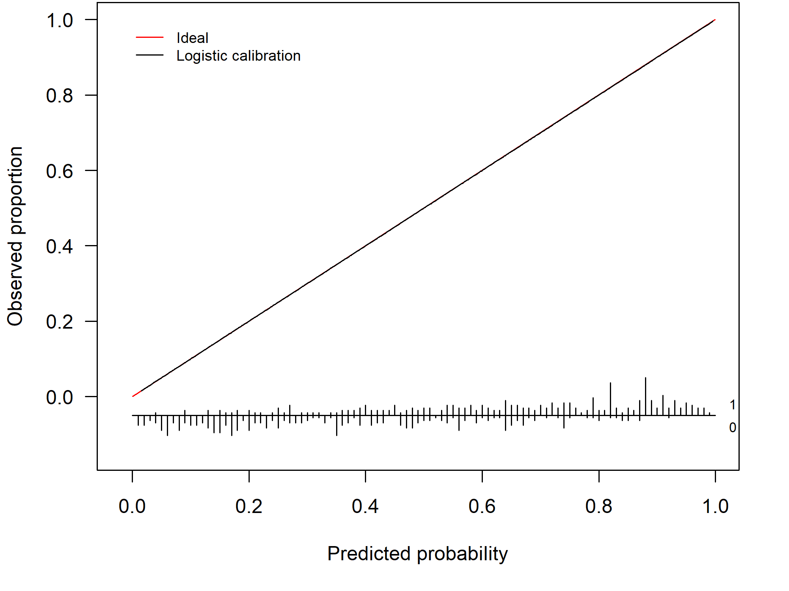

```{r setup, include = FALSE}
knitr::opts_chunk$set(
  collapse = TRUE,
  comment = "#>"
)
options(rmarkdown.html_vignette.check_title = FALSE)
```

<div>
```{r logo, echo=FALSE, out.width="25%"}
knitr::include_graphics("./CalibrationCurves.png")
```
</div>
<br clear="right">
In this document, we give you a brief overview of the basic functionality of the `CalibrationCurves` package. In addition, we present the theoretical framework behind calibration and provide some illustrative examples to give the reader a better insight into the calibration assessment of a predictive model. We advise you to also consult the help-pages of the functions to get an exhaustive overview of the functionality. 

We tried to tailor the explanation of the concepts to professionals with different backgrounds. Please, do contact me if you feel that something is unclear so that I can adjust (and hopefully improve) it. In addition, don't hesitate to send any suggestions you might have and bug reports to the package author.

# Assessing the performance of risk prediction models

## Risk prediction models
In this package, we focus on risk prediction models that estimate the probability $\pi_i$ of observing an event. We use $y_i \in (0, 1)$ to denote the variable that captures this outcome which takes on the value 0 in case of a non-event and 1 in case of an event. Here, $i$ serves as an index for the observations (mostly the patient within medical predictive analytics) with $i = (1, \dots, n)$ and where $n$ denotes the total number of observations. We assume that the response variable $y_i$ follows a Bernoulli distribution $y_i \sim \text{Bern}(\pi_i)$.

For example, we could be interested in estimating the probability $\pi_i$ of observing a malignant tumour for patient $i$. In this case, the event $y_i = 1$ is the tumour being malignant and $y_i = 0$ when the tumour is benign. With no available information on the patient characteristics, we might rely on the prevalence in the general population to estimate this probability. 

Using risk prediction models, we model the outcome as a function of the observed risk/patient characteristics. The risk characteristics are contained in the covariate vector $\boldsymbol{x}_i$. This vector contains all observed information for patient $i$ (e.g. maximum diameter of the lesion, proportion of solid tissue, ...). This allows us to obtain a more accurate prediction that is based on the relation between the patient characteristics and the outcome. To construct a clinical prediction model, we either rely on a statistical models such as logistic regression or machine learning methods. A general expression that encompasses both types of models is
\begin{align*}
E[y_i | \boldsymbol{x}_i] = f(\boldsymbol{x}_i).
\end{align*}
This expression states that we model the response $y_i$ as a function of the observed risk characteristics $\boldsymbol{x}_i$.


### Mathematical details on existing predictive models
To construct a risk prediction model, we could rely on a logistic regression model
\begin{align*}
E[y_i | \boldsymbol{x}_i] = \pi_i(\boldsymbol{\beta}) = \frac{e^{\boldsymbol{x}_i^\top \boldsymbol{\beta}}}{1 + e^{\boldsymbol{x}_i^\top \boldsymbol{\beta}}}
\end{align*}
where $\boldsymbol{\beta}$ denotes the parameter vector. $\pi_i(\boldsymbol{\beta}) = P(y_i = 1| \boldsymbol{x}_i)$ denotes the probability of observing the event, given the covariate vector $\boldsymbol{x}_i$. We can rewrite the equation to its more well-known form
\begin{align*}
\log\left( \frac{\pi_i(\boldsymbol{\beta})}{1 - \pi_i(\boldsymbol{\beta})} \right) &= \boldsymbol{x}_i^\top \boldsymbol{\beta}\\[0.5em]
\text{logit}(\pi_i(\boldsymbol{\beta})) &= \eta_i
\end{align*}
where $\eta_i$ denotes the linear predictor. Here, we have the well-known logit function at the left side of the equation.

With machine learning methods, $f(\cdot)$ depends on the specific algorithm. With tree-based methods, for example, this correspond to the observed proportion in the leaf nodes. For neural networks, $f(\cdot)$ is determined by the weights in the layers and the chosen activation functions.

## Different aspects of the predictive performance
To assess how well the model is able to predict (the probability of) the outcome, we assess two different aspects of the model [@VanCalster2016;@VanCalster2019;@Alba2017]: 

a) *discrimination*;
b) *calibration*. 

With *discrimination*, we refer to the model's ability to differentiate between observations that have the event and observations that have not. In this context, this translates to giving higher risk estimates for patients with the event than patients without the event. We commonly assess this using the area under the receiver operating characteristic curve. However, discrimination performance does not tell us how accurate the predictions are. The estimated risk may result in good discrimination and can be inaccurate at the same time. We refer to the accuracy of the predictions as the *calibration*. Hence, hereby we assess the agreement between the estimated and observed number of events [@VanCalster2016]. We say that a prediction model is calibrated if the predicted risks correspond to the observed proportions of the event. 

## Assessing the calibration performance of a risk prediction model

### A mathematical perspective
One way to examine the calibration of risk predictions, is by using calibration curves [@VanCalster2016;@VanCalster2019;@ClinicalPredictionModels;@Campo2023GCF]. A calibration curve maps the predicted probabilities $f(\boldsymbol{x}_i)$ to the actual event probabilities $P(y_i = 1| f(\boldsymbol{x}_i))$ and visualizes the correspondence between the model's predicted risks and the true probabilities. For perfectly calibrated predictions, the calibration curve equals the diagonal, i.e. $P(y_i = 1 | f(\boldsymbol{x}_i)) = f(\boldsymbol{x}_i) \ \forall \ i$ where $\forall \ i$ denotes for all $i$.

### A practical perspective
In practice, we typically assess the model's calibration on a validation set. In this setting, a calibration curve visualizes the correspondence between the model's predicted risks and the observed proportion. When we have a perfect agreement between the observed and predicted proportion the calibration curve coincides with the ideal curve (a diagonal line). This scenario is visualized in Figure \@ref(fig:PerfectCalibration).

```{r PerfectCalibration, fig.align = 'center', fig.cap = "Example of a perfectly calibrated model", fig.topcaption = TRUE, echo = FALSE, out.width="100%"}

```

By assessing the calibration performance on a data set other than the training set, we obtain an indication of how well our risk prediction is able to generalize to other data sets and how accurate its out-of-sample predictions are. In general, the prediction model will show some miscalibration and the calibration curve gives us a visual depiction of how badly the model is miscalibrated. The further from the diagonal line, the worse the calibration. Figure \@ref(fig:Overfitted) depicts an example of a model that is miscalibrated and is a typical example of a model that is overfitted to the training data. This particular model has predictions that are too extreme: high risks are overestimated and low risks are underestimated.

```{r Overfitted, fig.align = 'center', fig.cap = "Example of a miscalibrated model due to overfitting", fig.topcaption = TRUE, echo = FALSE, out.width="100%"}

```

Its counterpart, an underfitted model, occurs less frequently. \@ref(fig:Underfitted) shows the calibration curve of an underfitted model. Here, there is an overestimation for the low risks and an underestimation for the high risks.

```{r Underfitted, fig.align = 'center', fig.cap = "Example of a miscalibrated model due to underfitting", fig.topcaption = TRUE, echo = FALSE, out.width="100%"}

```

### How do we construct a calibration curve?
Fitting a logistic regression model to the training data results in an estimate for the parameter vector $\boldsymbol{\beta}$, which we denote as $\widehat{\boldsymbol{\beta}}$. The latter contains the estimated effects of the included covariates (e.g. proportion of solid tissue). To obtain a risk estimate for patient $i$, we multiply the covariate vector $\boldsymbol{x}_i$ (which contains all the patient-specific characteristics) with the estimated parameter vector $\widehat{\boldsymbol{\beta}}$ to obtain the linear predictor $\widehat{\eta}_i$
\begin{align*}
  \widehat{\eta}_i = \boldsymbol{x}_i^\top \widehat{\boldsymbol{\beta}}.
\end{align*}

To differentiate between the training and test set, we append the subscript $*$ to the quantities of the test set. Hence, ${}_{*} y_i$ denotes the outcome in the test set. Similarly, we use ${}_{*} \boldsymbol{x}_i$ to denote the covariate vector for patient $i$ in the test set. We then calculate the linear predictor on the test set as
\begin{align*}
  {}_{*} \widehat{\eta}_i = {}_{*} \boldsymbol{x}_i^\top \widehat{\boldsymbol{\beta}} \tag{1}.
\end{align*}

Similarly, we can predict the probability $\widehat{f}({}_{*} \boldsymbol{x}_i)$ for patient $i$ in the test set using machine learning methods. We use
\begin{align*}
  {}_{*} \widehat{\pi}_i = \widehat{f}({}_{*} \boldsymbol{x}_i)
\end{align*}
as a general notation to denote the predicted probability of the risk prediction model.


One way to compute the calibration curve, is by using a logistic regression model
\begin{align*}
  \text{logit}(P({}_{*} y_i = 1| {}_{*} \widehat{\pi}_i)) &= \alpha + \zeta \ \text{logit}({}_{*} \widehat{\pi}_i)
  (\#eq:logcal)
\end{align*}
where we estimate the observed proportions as a function of the predicted probabilities. This model fit yields a logistic calibration curve. Note that $\text{logit}({}_{*} \widehat{\pi}_i) = {}_{*} \widehat{\eta}_i$ when ${}_{*} \widehat{\pi}_i$ is estimated using a logistic regression model (see \@ref(eq:logcal)).

Alternatively, we can obtain flexible, nonlinear calibration curve using a non-parametric smoother such as loess or restricted cubic splines. In our package, we provide both types of calibration curves.

### Calibration intercept and slope
In addition to the calibration curve, we have two measures that summarize different aspects of the calibration performance:

- the calibration intercept $\alpha_c$ (calibration-in-the-large);
- the calibration slope $\zeta$.

We have a perfectly calibrated model when the calibration curve coincides with the diagonal line or when $\alpha =\alpha_c = 0$ and $\zeta = 1$.

To compute the calibration slope $\zeta$, we rely on the model used to obtain the logistic calibration curve (see equation \@ref(eq:logcal)). The value of the calibration slope $\zeta$ tells us whether the model is over- or underfitted. When $\zeta < 1$ the model is overfitted. $\zeta < 1$ indicates that ${}_{*} \eta_i$ is too extreme and needs to be lower to ensure that the predicted risks coincide with the observed risks. Conversely, we have a model that is underfitted when $\zeta > 1$.

To calculate the calibration intercept or calibration-in-the-large, we fix the calibration slope at $1$ and denote this as $\alpha|\zeta = 1$ or the short-hand notation $\alpha_c$. To estimate $\alpha_c$, we fit the model
\begin{align*}
  \text{logit}(P({}_{*} y_i = 1| {}_{*} \widehat{\pi}_i)) &= \alpha_c + \text{offset}(\text{logit}({}_{*} \widehat{\pi}_i))
  (\#eq:calintercept)
\end{align*}
where we enter $\text{logit}({}_{*} \widehat{\pi}_i)$ as an offset variable. Hereby, we fix $\zeta = 1$. The calibration intercept tells us whether the risks are overestimated $(\alpha_c < 0)$ or underestimated $(\alpha_c > 0)$ **on average**.

## Illustration of the CalibrationCurves package

### Training the model 
To illustrate the functionality, the package has two example data sets: `traindata` and `testdata`. These are two synthetically generated data sets (using the same underlying process/settings to generate the data) to illustrate the functionality of the `CalibrationCurves` package. 

The `traindata` data frame represents the data that we will use to develop our risk prediction model
```{r}
library(CalibrationCurves)
data("traindata")
```
In this data frame, we have four covariates and one response variable `y`.
```{r}
head(traindata)
```
Next, we fit a logistic regression model to obtain the estimated parameter vector $\widehat{\beta}$.
```{r}
glmFit = glm(y ~ . , data = traindata, family = binomial)
summary(glmFit)
```

### Assessing the calibration performance
Hereafter, we assess the calibration performance on the `testdata` set. Hereto, we first have to compute the predicted probabilities on this data set.
```{r}
data("testdata")
pHat = predict(glmFit, newdata = testdata, type = "response")
```
We then store the response in the `testdata` in a separate vector `yTest`.
```{r}
yTest = testdata$y
```
Now we have everything we need to assess the calibration performance of our prediction model. We can either use `val.prob.ci.2` or `valProbggplot` to visualize the calibration performance and to obtain the statistics. `val.prob.ci.2` makes the plot using `base` R and `valProbggplot` uses the `ggplot2` package.

By default, the flexible calibration curve (based on a loess smoother) will be plotted.
```{r,  out.width="100%"}
calPerf = val.prob.ci.2(pHat, yTest)
```
In addition to the plot, the function returns an object of the class `CalibrationCurve`.
```{r}
calPerf
```
This object contains the calculated statistics as well as the calculated coordinates of the calibration curve.
```{r}
str(calPerf)
```

The coordinates are stored in the `CalibrationCurves` slot and can be extracted as follows.
```{r}
flexCal = calPerf$CalibrationCurves$FlexibleCalibration
plot(flexCal[, 1:2], type = "l", xlab = "Predicted probability", ylab = "Observed proportion", lwd = 2, xlim = 0:1, ylim = 0:1)
polygon(
  x = c(flexCal$x, rev(flexCal$x)),
  y = c(
    flexCal$ymax,
    rev(flexCal$ymin)
  ),
  col = rgb(177, 177, 177, 177, maxColorValue = 255),
  border = NA
)
```


Alternatively, we can use restricted cubic splines to obtain the flexible calibration curve.
```{r rcsFit,  out.width="100%"}
rcsFit = tryCatch(val.prob.ci.2(pHat, yTest, smooth = "rcs"),
                  error = function(e) TRUE)
if(is.logical(rcsFit)) {
  plot(1, type = "n", xlab = "", ylab = "", xlim = c(0, 10), ylim = c(0, 10))
  text(x = 5, y = 5, labels = paste0("There was a problem estimating\n",
                                     "the calibration curve using rcs"), cex = 2)
} else {
  rcsFit
}
```

We obtain the logistic calibration curve using the following code.
```{r,  out.width="100%"}
invisible(val.prob.ci.2(pHat, yTest, logistic.cal = TRUE, smooth = "none"))
```

We can plot both using
```{r,  out.width="100%"}
invisible(val.prob.ci.2(pHat, yTest, logistic.cal = TRUE, col.log = "orange"))
```

The package also allows to change the colors, change the position of the legend and much more. Check out the help-function to see what other arguments the functions have.

```{r,  out.width="100%"}
invisible(val.prob.ci.2(pHat, yTest, col.ideal = "black", col.smooth = "red", CL.smooth = TRUE,
              legendloc = c(0, 1), statloc = c(0.6, 0.25)))
```

Finally, we can also decide which statistics appear on the plot.
```{r,  out.width="100%"}
invisible(val.prob.ci.2(pHat, yTest, dostats = c("C (ROC)", "Intercept", "Slope", "ECI")))
```

### ggplot version
The ggplot version (i.e.`valProbggplot`) uses virtually the same arguments. Hence, we can easily obtain a ggplot using the same code. 
```{r,  out.width="100%"}
valProbggplot(pHat, yTest)
```

# Assessing the performance of survival models

## Cox Proportional hazards model
The Cox proportional hazards model is a widely used method for analyzing survival data. It estimates the hazard function, which represents the instantaneous risk of an event occurring at time \( t \), given that the subject has survived up to \( t \). For patient \( i \) with covariate vector \( \boldsymbol{x}_i \), the hazard function is given by:


\begin{align*}
  h(t | \boldsymbol{x}_i) &= h_0(t) \exp(\boldsymbol{x}_i^\top \beta)\\
  &= h_0(t) \exp(\eta_i)
\end{align*}

where

 - \( h(t | \boldsymbol{x}_i) \) is the hazard function at time \( t \) for subject \( i \),
 - \( h_0(t) \) is the baseline hazard function at time $t$, which is shared by all individuals.


In this model, the survival probability for an individual \( i \) at time \( t \) is given by

\[
S_i(t) = \exp\left(-H_i(t)\right)
\]

where \( H_i(t) \) is the cumulative hazard function:

\[
H_i(t) = H_0(t) \exp( \eta_i)
\]

where \( H_0(t) \) is the **baseline cumulative hazard function**.

### Calibration Curve
We can estimate the calibration curve in this scenario by entering the linear predictor $\eta_i$ as a covariate   
\begin{align*}
  h(t | {}_{*} \eta_i) &= h_0(t) \exp(\zeta {}_{*} \eta_i)\\
\end{align*}
where $\zeta$ is the calibration slope that quantifies the relationship between the predicted and observed hazards. Similarly to \@ref(eq:logcal), $\zeta$ indicates whether the model is over- ($\zeta < 1$) or underfitted ($\zeta >1$). Note that we do not have a calibration intercept in this model. This is because the baseline hazard function $h_0(t)$ is not estimated in the Cox model, and the model is only identified up to a proportionality constant. As a result, any intercept term would be absorbed into the baseline hazard function, and would not be separately identifiable.

We do not explicitly specify the time point $t$, as calibration can be assessed either across all follow-up time points or at a specific time point of interest. To estimate this model, we can fit a Cox proportional hazards model. 

Below is a short example illustrating how you can assess the calibration performance of a Cox proportional hazards model using the package. Here, we first fit the model using `coxph` from the `survival` package. to assess the calibration performance, we pass the object containing the model fit along with the external validation data set to the `valProbSurvival` function.

```{r}
library(survival)
data(trainDataSurvival)
data(testDataSurvival)
sFit = coxph(Surv(ryear, rfs) ~ csize + cnode + grade3, data = trainDataSurvival,
             x = TRUE, y = TRUE)
calPerf = valProbSurvival(sFit, testDataSurvival, plotCal = "ggplot", nk = 5)
```


Next to the plot, you also get a range of statistics that assess the calibration performance.
```{r}
calPerf
```
# Assesing the calibration of prediction models in clustered datasets
In many applications, data have a hierarchical structure. For example, patients (level 1) are nested within hospitals (level 2). In such cases, the observations within the same cluster (e.g., hospital) may be more similar to each other than to those in different clusters.

Barreñada and colleagues (@citepaper) propose three approaches to obtain calibration curves
accounting for clustering when the outcome is binary. These approaches are implemented in the `CalibrationCurves` package through the `valProbCluster` function.

We will illustrate the methods using a clustered dataset

```{r}
library(dplyr)
data("ClusteredData")
```

## Clustered Group Calibration (CG-C)

CG-C is an extension of traditional *grouped calibration* (binning calibration) for datasets with **clustered structure** — for example, multi-center studies or hierarchical data.

In traditional grouped calibration:
- All data is pooled.
- Observations are divided into equal-sized groups based on predicted risks.
- For each group, the observed event rate is plotted against the mean predicted risk.

In CG-C:
- Grouping is performed **within each cluster first**.
- Cluster-level results are combined across clusters via **bivariate random-effects meta-analysis**, capturing:
  - **Between-cluster heterogeneity**
  - **Within-cluster sampling error**

Two grouping strategies are available:
- `"grouped"`: Equal-sized quantile groups within each cluster
- `"interval"`: Fixed-width intervals in (0, 1) within each cluster

Detailed methodological overview can be found in the published [article](https://doi.org/10.48550/arXiv.2503.08389).

### Method Overview

#### CG-C (Grouped)
1. **Per cluster j**:
   - Split predicted probabilities into Q quantiles.
2. **For each cluster and quantile**:
   - Compute mean observed outcome (ȳ_{qj}), mean predicted probability (π̄_{qj}), and sample size.
3. **Per quantile q**:
   - Perform **bivariate random-effects meta-analysis** of logit(π̄_{qj}) and logit(ȳ_{qj}) using an unstructured variance–covariance matrix and random intercepts for clusters.


```{r}
res_cgcg <- valProbCluster(
  data = data_test_cluster,
  p = preds, y = y, cluster = center, pl = T,
  approach = "CGC",
  method = "grouped"
)

res_cgcg$ggplot


```


#### CG-C (Interval)
Same algorithm, except Step 1 uses equally spaced probability intervals instead of quantiles.

```{r}
res_cgci <- valProbCluster(
  data = data_test_cluster,
  p = preds, y = y, cluster = center, pl = T,
  approach = "CGC",
  method = "interval"
)

res_cgci$ggplot

```


### Interpretation

- **Black**: Traditional grouped calibration curve (pooled data)
- **Gold**: CG-C pooled curve across clusters
- **Shaded areas**:
  - Light blue = 95% Prediction Interval (expected calibration curve in new clusters)
  - Cornflower blue = 95% Confidence Interval (expected calibration of the pooled curve)

CG-C provides calibration estimates that account for cluster-level variability, making it more representative of model performance in new or unseen clusters.


## Two stage meta-analysis calibration (2MA-C)

This approach first fits a calibration model per cluster and then it meta-analyses the
performance of each cluster to obtain the overall calibration curve. 

### Method Overview

**Stage 1**

Fit a model per center and estimate observed proportion for a grid of values (e.g., 100 values from 0.001 to 0.999):

$$ \text{logit}(y_{ji}) = \alpha_j + \beta_j \cdot \eta_{ji}$$

---

**Stage 2**

Pool observed proportion per grid value $g$ using a random effects model:

$$
\hat{y}_{gj} = y_g + u_{gj} + \epsilon_{gj}, \quad \epsilon_j \sim N(0, \sigma_{gj}^2), \quad u_j \sim N(0, \tau_g^2)
$$

Where:
$\hat{y}_{gj}$ is the estimated observed proportion from model $j$ for value $g$ in the grid.
$u_j$ is the random effect for center $k$.
$\(\epsilon_j\)$ is the sampling error or within-study variance.

Here:
$\tau_g^2$ is the between-study variability or heterogeneity, estimated using REML.
$s_j^2$ is the within-study variability.

Confidence intervals can be calculated using:

 **Default Method**: $\hat{y}_g \pm z_{1 - \alpha/2} \cdot SE(\hat{y}_g)$


 **HKSJ Method**: $\hat{y}_g \pm t_{(J-2)} \sqrt{\frac{\sum w_j (\hat{y}_{gj} - \hat{y}_g)^2}{N-1} + SE(\hat{y}_g)^2}$ (recommended for a small number of studies)


Where: $SE(\hat{y}_g) = \sqrt{\frac{s^2}{n_{gj}} + \frac{\tau_{gj}^2}{N}}$

Prediction intervals are based on the \(t\)-distribution, as explained in Higgins et al (2009): $\hat{y}_g \pm t_{(J-2)} \sqrt{\tau^2 + SE(\hat{y}_g)^2}$

Other supported methods for prediction intervals include:
 **Hartung-Knapp**, 
 **Kenward-Roger**,
 **Bootstrap Approach**, or 
 **Standard Normal Quantile**.
Detailed methodological overview can be found in the published [article](https://doi.org/10.48550/arXiv.2503.08389).

```{r}
res_mac2_spl <- valProbCluster(
  data = data_test_cluster,
  p = preds, y = y, cluster = center, pl = T,
  approach = "MAC2", knots = 3, grid_l = 100,
  method_choice = "splines", methods = "splines"
)
res_mac2_spl$ggplot
res_mac2_loess <- valProbCluster(
  data = data_test_cluster,
  p = preds, y = y, cluster = center, pl = T,
  approach = "MAC2", grid_l = 100,
  method_choice = "loess", methods = "loess",
)
res_mac2_loess$ggplot
```

### Interpretation

- **Black (dashed)**: 2MA-C pooled curve across clusters
- **Black (solid)**: Center specific curves (if `center_curves = TRUE`)
- **Red shaded areas**:
  - Light red = 95% Prediction Interval (expected calibration curve in new clusters)
  - Dark red = 95% Confidence Interval (expected calibration of the pooled curve)


2MA-C provides calibration estimates that account for cluster-level variability, making it more representative of model performance in new or unseen clusters and at the same time calculate center specific calibration curves. Note that in this example the clustering is based on normally distributed random effect, which might not be the case in real life scenarios. Due to this, the splines model seems to fit better than the loess model. However if the random effects follows a more complex structure, the loess model might be more appropriate.

## Mixed model calibration (MIX-C)

In this approach we fit a mixed effects logistic regression model with random intercept and slope to account for the clustered structure of the data. 

### Method Overview

In this approach, we estimate the observed proportion as

$$
\hat{p}^{(o)}_{ij} = \text{logit}^{-1} \left[ \hat{s}\left( \text{logit}(\hat{\pi}(x_{ij})) \right) + \tilde{s}_j \, \hat{\left( \text{logit}(\hat{\pi}(x_{ij})) \right)} \right]
$$

where $\hat{s}$ and $\tilde{s}_j$ denote the estimated smooth effects.  
We take the variance of both the fixed and random components into account when calculating the variance of the linear predictor, and we approximate the standard error of $\hat{p}^{(o)}_{ij}$ using the delta method.

To keep the confidence interval within $[0, 1]$, we construct the interval as:

$$
\min \left( 1, \max\left( 0, \hat{p}^{(o)}_{ij} \mp z_{1-\alpha/2} \, \text{se}\left( \hat{p}^{(o)}_{ij} \right) \right) \right)
$$

where $z_{1-\alpha/2}$ denotes the quantile of the standard normal distribution that corresponds to the cumulative probability of $1 - \alpha/2$ (i.e., $1.96$ for a 95% CI).

Prediction intervals are calculated using the `predictInterval` function in **R** with 10,000 samples (simulation-based).  
This function takes into account:

- The uncertainty at the observation level (residual variance)
- The fixed coefficients
- The random effects

In this method:

1. We first obtain the random and fixed effects.
2. We generate $n$ samples (default = 10,000) based on a multivariate normal distribution of the random and fixed effects, separately.
3. We calculate the linear predictor in each sample.
4. We predict the upper and lower limits of the prediction interval.

Detailed methodological overview can be found in the published [article](https://doi.org/10.48550/arXiv.2503.08389).

```{r}
library(merTools)
res_mixc_itc <- valProbCluster(
  p = data_test_cluster$preds, y = data_test_cluster$y, cluster = data_test_cluster$center,
  pl = T,
  approach = "MIXC", method = "intercept", grid_l = 100
)
res_mixc_itc$ggplot
res_mixc_slo <- valProbCluster(
  p = data_test_cluster$preds, y = data_test_cluster$y, cluster = data_test_cluster$center,
  pl = T,
  approach = "MIXC", method = "slope", grid_l = 100
)
res_mixc_slo$ggplot

```

### Interpretation

- **Black (dashed)**: MIX-C pooled curve across clusters
- **Black (solid)**: Center specific curves (if `center_curves = TRUE`)
- **Green shaded areas**:
  - Light green = 95% Prediction Interval (expected calibration curve in new clusters)
  - Dark green = 95% Confidence Interval (expected calibration of the pooled curve it can be calculated with Delta method or normal approximation)


MIX-C is a mixed-effects logistic calibration model using restricted cubic splines with random intercepts and slopes per cluster, designed to account for both fixed and random effects in calibration. It performs especially well for cluster-specific calibration curves, particularly when sample sizes per cluster are small, due to its shrinkage properties. A limitation is that its prediction intervals can be inconsistently too narrow or too wide, and like other methods, it tends to underestimate between-cluster heterogeneity. Overall, MIX-C is recommended for producing cluster-specific calibration plots, while other methods may be preferred for average-effect curves.


  

# Assessing the performance of other types of prediction models
In my recent paper [@Campo2023GCF], I propose an extension of the logistic calibration framework to distributions that belong to the exponential family with probability density function (pdf)
\begin{align*}
		f(y_i; \theta_i, \phi, w_i) = \exp\left( \frac{y_i \theta_i - b(\theta_i)}{\phi} w_i  + c(y_i, \phi, w_i)\right).
\end{align*}

\noindent
Here, $\theta_i$ is the natural parameter, $\phi$ the dispersion parameter and $w_i$ the weight. $b(\cdot)$ and $c(\cdot)$ are known functions. Similar to before, we assume that there is an unknown regression function $r(\boldsymbol{x}_i) = E[y_i | \boldsymbol{x}_i]$. To approximate this unknown function, we rely on prediction models with the following functional form
\begin{align*}
	E[y_i | \boldsymbol{x}_i] = \mu_i = f(\boldsymbol{x}_i).
	(\#eq:PredModel)
\end{align*}

\noindent
To estimate \@ref(eq:PredModel), we can use a generalized linear model
\begin{align*}
		g(E[y_i | \boldsymbol{x}_i]) = \boldsymbol{x}_i^\top \boldsymbol{\beta} = \eta_i.
		(#eq:GLM)
\end{align*}
where $g(\cdot)$ denotes the link function. Alternatively, we can estimate \@ref(eq:PredModel) using machine learning methods. Using the model fit, we obtain the predictions $\widehat{\mu}_i = \widehat{f}(\boldsymbol{x}_i)$.


## Generalized calibration curves
To examine the calibration of prediction models where the outcome is a member of the exponential family, we redefine the framework in more general terms. In this context, a calibration curve maps the predicted values $f(\boldsymbol{x}_i)$ to $E[y_i| f(\boldsymbol{x}_i)]$, the actual conditional mean of $y_i$ given $f(\boldsymbol{x}_i)$. As before, a model is perfectly calibrated if the calibration curve equals the diagonal, i.e. $E[y_i | f(\boldsymbol{x}_i)] = f(\boldsymbol{x}_i) \ \forall \ i$. Hence, in this context, the calibration curve captures the correspondence between the predicted values and the conditional mean. 

We propose two methods to estimate the calibration curve. Firstly, we can estimate the calibration curve using a generalized linear model
\begin{align*}
		g(E[{}_{*} y_i | {}_{*} \widehat{\mu}_i]) = \alpha + \zeta \ g({}_{*} \widehat{\mu}_i).
		(#eq:CalibrationGLM)
\end{align*}

By transforming ${}_{*} \widehat{\mu}_i$ using the appropriate $g(\cdot)$, we map ${}_{*} \widehat{\mu}_i$ to the whole real line to better fit the model. If ${}_{*} \widehat{\mu}_i$ is estimated using a generalized linear model with the same link function (i.e. $g(\cdot)$ is identical in \@ref(eq:GLM) and \@ref(eq:CalibrationGLM)), it follows that $g({}_{*} \widehat{\mu}_i) = {}_{*} \widehat{\eta}_i$. Using equation \@ref(eq:CalibrationGLM), we estimate the empirical average as a function of the predicted values. Further, similarly to \@ref(eq:logcal), $\zeta$ tells us whether the model is over- ($\zeta < 1$) or underfitted ($\zeta >1$). We estimate the calibration-in-the-large $\alpha_c$ as
\begin{align*}
		g(E[{}_{*} y_i | {}_{*} \widehat{\mu}_i]) = \alpha_c + \text{offset}(g({}_{*} \widehat{\mu}_i)).
		(#eq:CITLGLM)
\end{align*}
Hereby, we assess to which extent the observed empirical average equals the average predicted value. Secondly, as with the logistic regression model, we can employ non-parametric smoothers to estimate the calibration curve.

## Illustration of the generalized calibration framework
### Training the model 
To illustrate the functionality, the package has two example data sets with a poisson distributed outcome variable: `poissontraindata` and `poissontestdata`. These are two synthetically generated data sets (using the same underlying process/settings to generate the data) to illustrate the functionality of the `CalibrationCurves` package. 

The `poissontraindata` data frame represents the data that we will use to develop our prediction model.
```{r}
data("poissontraindata")
```
In this data frame, we have five covariates and one response variable `y`.
```{r}
head(traindata)
```
Next, we fit a Poisson GLM with log link to obtain the estimated parameter vector $\widehat{\beta}$.
```{r}
glmFit = glm(Y ~ . , data = poissontraindata, family = poisson)
summary(glmFit)
```

### Assessing the calibration performance
Hereafter, we assess the calibration performance on the `poissontestdata` set. Hereto, we first have to compute the predicted values on this data set.
```{r}
data("poissontestdata")
yHat = predict(glmFit, newdata = poissontestdata, type = "response")
```
We then store the response in the `poissontestdata` in a separate vector `yTest`.
```{r}
yTest = poissontestdata$Y
```
Now we have everything we need to assess the calibration performance of our prediction model. We can use `genCalCurve` to visualize the calibration performance and to obtain the statistics. `genCalCurve` makes the plot using `base` R and a ggplot version will be included in one of the next updates.

By default, the calibration curve as estimated by a GLM will be plotted. Further, in addition to the outcome and the predicted values, we have to specify the distribution of the response variable.
```{r,  out.width="100%"}
calPerf = genCalCurve(yTest, yHat, family = poisson)
```
In addition to the plot, the function returns an object of the class `GeneralizedCalibrationCurve`.
```{r}
calPerf
```
This object contains the calculated statistics as well as the calculated coordinates of the calibration curve.
```{r}
str(calPerf)
```

The coordinates are stored in the `CalibrationCurves` slot and can be extracted as follows.
```{r}
GLMCal = calPerf$CalibrationCurves$GLMCalibration
plot(GLMCal[, 1:2], type = "l", xlab = "Predicted value", ylab = "Empirical average", lwd = 2, xlim = 0:1, ylim = 0:1,
     col = "red", lty = 2)
abline(0, 1, lty = 1)
```

# FAQ

## Why is the calibration intercept different in the rms package?
To construct the logistic calibration curve (see [How do we construct a calibration curve?]), we fit the model
\begin{align*}
\text{logit}(E[{}_{*} y_i | {}_{*} \widehat{\pi}_i]) = \alpha + \zeta \ \text{logit}({}_{*} \widehat{\pi}_i)
\end{align*}
Here, $\zeta$ corresponds to the calibration slope. The calibration intercept from the `val.prob` function from the `rms` package corresponds to $\alpha \neq \alpha_c$.

In the `CalibrationCurves` package, the calibration intercept corresponds to $\alpha_c$ which assesses the calibration in the large. Using this formulation, the calibration intercept indicates whether the predicted risks are under- or overestimated on average and this is conform with the definition of the calibration intercept in the article 'A calibration hierarchy for risk models was defined: from utopia to empirical data' (and other articles published on this topic) [@VanCalster2016;@VanCalster2019]. We compute $\alpha_c$ using
\begin{align*}
\text{logit}(E[{}_{*} y_i | {}_{*} \widehat{\pi}_i]) = \alpha_c + \text{offset}(\text{logit}({}_{*} \widehat{\pi}_i)).
\end{align*}
where we fix $\zeta = 1$ by including $\text{logit}({}_{*} \widehat{\pi}_i)$ as an offset variable.

Consequently, both types of calibration intercepts need to be interpreted differently:

- $\alpha$:
    - this corresponds to the constant you have to add after you multiplied the linear predictor with the ‘correction’ factor (i.e. the calibration slope) to get the predicted probabilities to correspond to the observed ones. In essence: once we have multiplied the linear predictor by a correction factor, what is the constant that we still have to add to make the predicted probabilities correspond to the observed ones?
- $\alpha_c$:
    -	$> 0$: ${}_{*} \widehat{\pi}_i$ is too low on average and hence, on average the risks are underestimated. You have to increase it to make it correspond to the observed probabilities.
    -	$< 0$: ${}_{*} \widehat{\pi}_i$ is too high on average and hence, on average the risks are overestimated. You have to decrease it to make it correspond to the observed probabilities.


## I have predicted probabilities of 0 or 1. Why is this not allowed by default and why do I get these annoying warning messages?
Predicted probabilities of 0 or 1 imply that there is no more randomness and that the process is deterministic. If the process was truly deterministic, we would not have to model it. Mostly the presence of perfect predictions signifies that something went wrong when fitting the model or that the model is severely overfitted. We therefore make sure that this is not allowed by default and delete these observations. We observe this behavior in the following cases:
 <br /> - logistic regression: with quasi-complete separation, the coefficients tend to infinity;
 <br /> - tree-based methods: one of the leaf nodes contains only observations with either 0 or 1;
 <br /> - neural networks: the weights tend to infinity and this is known as weight/gradient explosion.
 
If you are confident that nothing is wrong with the model fit, then you can obtain a calibration curve by setting the argument `allowPerfectPredictions` to `TRUE`. In this case, predictions of 0 and 1 are replaced by values 1e-8 and 1 - 1e-8, respectively. Do take this into account when interpreting the performance measures, as these are not calculated with the original values.
```{r,  out.width="100%"}
set.seed(1)
yTest = testdata$y
pHat[sample(1:length(pHat), 5, FALSE)] = sample(0:1, 5, TRUE)
x = val.prob.ci.2(pHat, yTest, allowPerfectPredictions = TRUE)
```

# References
<div id="refs"></div>
